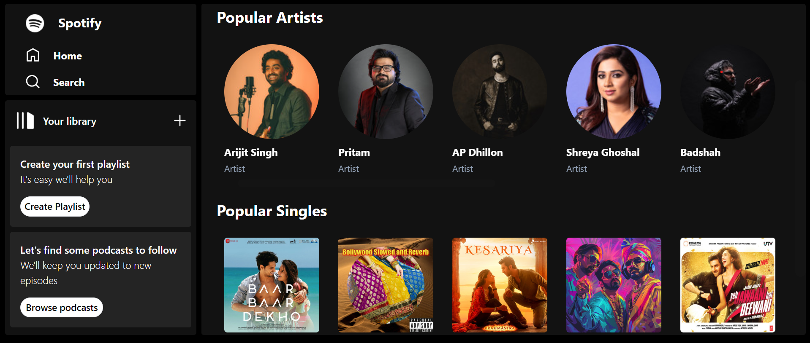

# Spotify Music App

## 🙌 Introduction

This project is a Spotify Clone built using modern web development technologies. The app is fully responsive, and users can browse music albums, search for tracks, and enjoy a seamless experience across devices. This web application is built using React, Tailwind, Redux Toolkit, Firebase and other various technologies.

## Features

- Responsive Design: The app is fully responsive, providing an optimal user experience across all devices.
- Search Functionality: Search for music tracks and albums.
- Browse Music Albums: Browse music albums directly using the Rapid API.
- Authentication: Firebase authentication for user login and signup.
- State Management: Managed using Redux Toolkit.
- Icons: Integrated with React Icons for a modern look.
- Routing: Utilizes React Router DOM for seamless navigation between different pages.

  ## Technologies Used

- React: JavaScript library for building user interfaces.
- Tailwind CSS: Utility-first CSS framework for styling.
- Firebase: Authentication and backend integration.
- Redux Toolkit: State management for handling app-wide state.
- React Icons: Icon set for visual enhancement.
- Rapid API: Fetching music data.
- React Router DOM: Routing for navigation between components.
- HTML5: For structuring web content.

## ❓ How To Use

1. Fork this repository

2. Clone your repository (do not forget to add your account name):
   bash
   $ git clone https://github.com/[YOUR ACCOUNT NAME]/.

3. Go into the repository and install dependencies:
   bash

$ npm install

4. Add all needed Environmental variables to .env.

## Deployment Link

[https.........](https://spotify-clone-oeqr.onrender.com)

## Authors

Ankit Kumar and Dishant Shinde

## Email

ankitchauhandhoni@gmail.com
dishantshinde13@gmail.com
